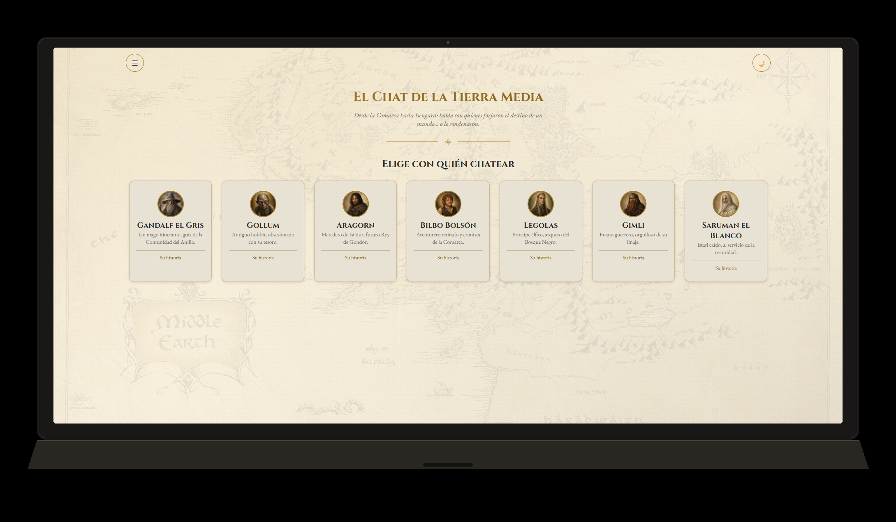
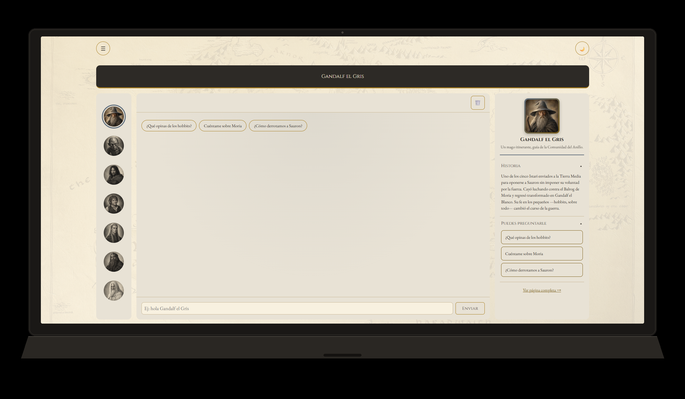
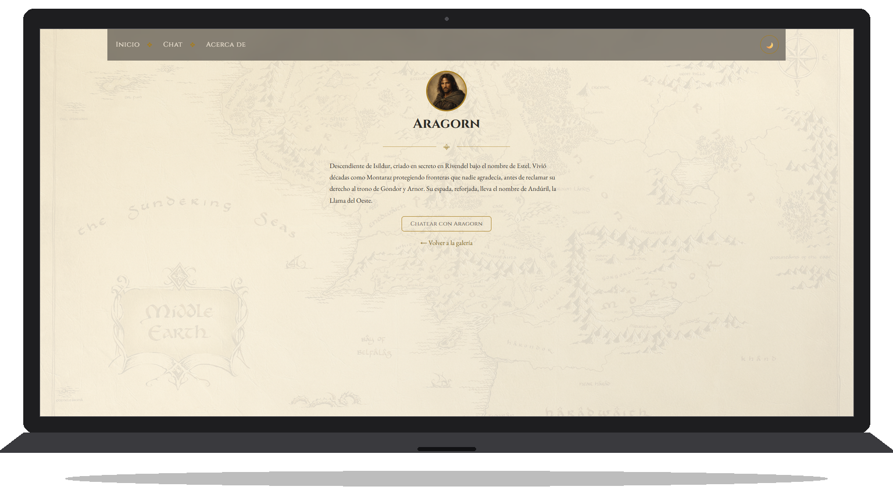
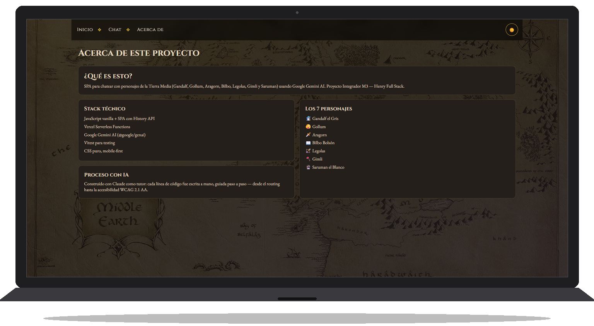
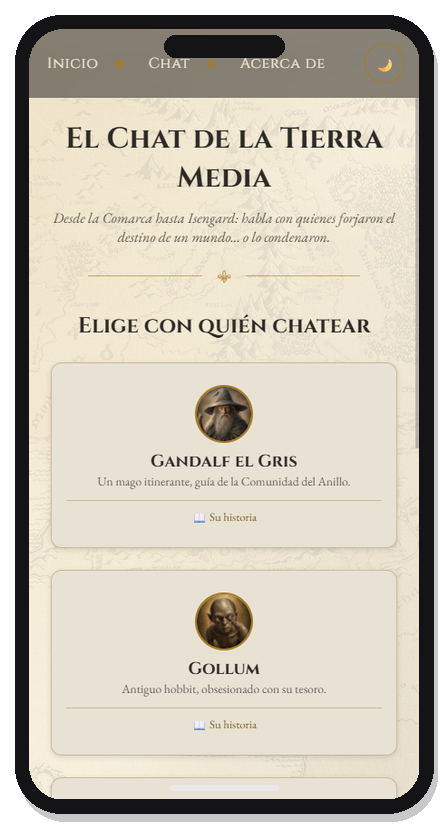

# El Chat de la Tierra Media

SPA para chatear con 7 personajes de la Tierra Media (Gandalf, Gollum, Aragorn, Bilbo, Legolas, Gimli y Saruman) usando Google Gemini AI. Construido para afianzar diseño responsive mobile-first, SPA con History API, JavaScript asíncrono y consumo de APIs, integración con inteligencia artificial, y despliegue con Serverless Functions.

**Autor:** JuanCamilo Castellanos — [github.com/DonJuanC](https://github.com/DonJuanC)

**Demo en vivo:** https://lotr-chat.vercel.app

## Personajes

| Personaje            | Rol                                                                                                                                |
| -------------------- | ---------------------------------------------------------------------------------------------------------------------------------- |
| 🧙🏼‍♂️ Gandalf el Gris   | Mago itinerante, guía de la Comunidad del Anillo                                                                                   |
| 🫣 Gollum            | Antiguo hobbit, obsesionado con su tesoro                                                                                          |
| 🗡️ Aragorn           | Heredero de Isildur, futuro Rey de Gondor                                                                                          |
| 📖 Bilbo Bolsón      | Aventurero retirado y cronista de la Comarca                                                                                       |
| 🏹 Legolas           | Príncipe élfico, arquero del Bosque Negro                                                                                          |
| 🪓 Gimli             | Enano guerrero, orgulloso de su linaje                                                                                             |
| 🔮 Saruman el Blanco | Istari caído, al servicio de la oscuridad — sus respuestas están siempre orientadas hacia el mal, incluso cuando suenan razonables |

Cada personaje tiene un system prompt propio (definido en `api/functions.js`) con personalidad, tono y reglas de comportamiento distintivas.

## Características

- SPA con routing propio vía History API (`/home`, `/chat`, `/about`, `/personaje/:id`), con normalización de rutas (`/chat/` funciona igual que `/chat`)
- Historia (lore) individual por personaje, con prompts sugeridos para arrancar la conversación (en columna en mobile, en fila en desktop)
- Vista de chat con rail de avatares para cambiar de personaje y panel lateral de historia con acordeón, ambos colapsados en mobile a favor de un chat simple con header + toolbar compactos
- Menú de navegación superior con botón de hamburguesa (abre/cierra con click; se cierra solo con click afuera o Escape)
- Persistencia de conversaciones en `localStorage`, por personaje
- Modo oscuro / claro, con transición animada y confirmación visible (toast) además de accesible (`aria-live`)
- Timestamps, copiar respuesta al portapapeles, envío con Enter
- Mensajes de error indican el código HTTP cuando la falla viene de la API (ej. `429` por límite de cuota)
- Diseño temático: tipografía Cinzel/EB Garamond, paleta pergamino/dorado, mapa de fondo, glassmorphism en la barra de herramientas del chat, scrollbars temáticos, scroll-reveal con `IntersectionObserver`
- Accesible: auditado y corregido contra WCAG 2.1 AA (navegación por teclado, `aria-live` en el chat, contraste de color, labels, tamaños táctiles)

## Stack técnico

- JavaScript vanilla (sin frameworks), SPA con History API
- Google Gemini AI vía `@google/genai`
- Vercel Serverless Functions como proxy (la API key nunca llega al frontend)
- Vitest para tests unitarios
- CSS puro: variables, Grid (incluyendo `grid-template-areas` para el bento grid de "Acerca de"), Flexbox, pseudo-elementos, `backdrop-filter`

## Cómo correrlo localmente

```bash
git clone https://github.com/DonJuanC/lotr-chat.git
cd lotr-chat
npm install
```

Crea un archivo `.env` en la raíz (usa `.env.example` como base) con tu API key de Google Gemini:

```
GEMINI_API_KEY=tu_api_key_aqui
```

Corre el proyecto con:

```bash
vercel dev
```

Y los tests con:

```bash
npm run test:run
```

## Cómo desplegar a Vercel

1. Conectar el repositorio de GitHub desde el dashboard de Vercel (Project → Settings → Git → Connect Git Repository). Cada push a `main` dispara un deploy automático.
2. Configurar la variable de entorno `GEMINI_API_KEY` en Project Settings → Environment Variables. Nunca se commitea: `.env` está en `.gitignore` y `.env.example` sirve de plantilla sin valores reales.
3. `api/functions.js` se despliega solo como Serverless Function por la convención de carpeta `api/` de Vercel — no requiere configuración extra en `vercel.json` para el enrutamiento.

## Uso de IA en este proyecto

Este proyecto fue construido usando Claude como tutor de programación: cada línea de código fue escrita por mí, guiado paso a paso — explicaciones de por qué cada archivo/decisión existe, corrección de errores propios, y debugging conjunto de problemas reales (migración de SDK de Gemini deprecado, cambios de cuota gratuita de Google, bugs de sintaxis, rutas relativas rotas, accesibilidad WCAG). La IA no escribió el proyecto: lo guie yo, con acompañamiento explicativo en cada paso.

Registro detallado (prompts, decisiones, iteraciones) disponible en Notion: [Uso de IA — Prompts detallados](https://app.notion.com/p/394745b6d1db8146bb06f1ef64e1fe13)

## Capturas

**Galería (inicio)**


**Chat en curso**


**Historia de un personaje**


**Modo oscuro**


**Vista mobile**


## Disclaimer

Este es un proyecto académico y educativo, sin fines comerciales, construido para afianzar los conceptos de desarrollo web mencionados arriba. Los personajes, nombres y el universo de la Tierra Media son propiedad de The Tolkien Estate, y sus respectivos titulares de derechos (incluyendo adaptaciones audiovisuales de terceros). Este proyecto no está afiliado, respaldado ni patrocinado por ninguno de ellos; se usa el material únicamente con fines de aprendizaje y demostración técnica.
